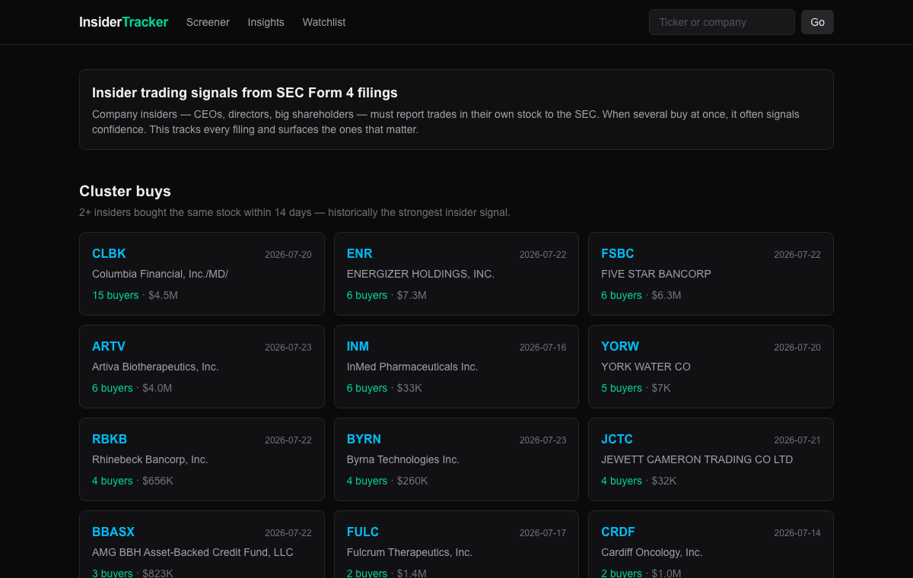

# Insider Tracker

[](https://github.com/alexislowys/insider-tracker/actions/workflows/ci.yml)
[](https://insider-tracker-three.vercel.app)


Track SEC Form 4 insider buys and sells: cluster-buy signals, per-company flow, and executive activity. Built with Next.js, PostgreSQL, and the SEC EDGAR API.

**▶ Live: [insider-tracker-three.vercel.app](https://insider-tracker-three.vercel.app)** · **📄 [Engineering case study](docs/CASE_STUDY.md)**



## Features

- **Cluster-buy detection** — flags companies where 2+ distinct insiders bought within 14 days, historically the strongest insider signal
- **Open-market trade feed** — latest buys (code P) and sells (code S), filtered from the noise of grants and option exercises
- **Company pages** — insider activity timeline plus a 90-day buy/sell dollar-flow chart
- **Insider pages** — full transaction history for any executive or director
- **Self-healing daily ingestion** — Vercel Cron re-ingests a 3-day window each weekday; ingestion is idempotent so overlaps and reruns are free

## Signal evaluation

Track-record stats are designed to resist the obvious abuses:

- **Median return, not mean** — headline insider stats use the median; a single microcap moonshot shouldn't mint a "top insider." The mean is shown as labeled context.
- **Market-adjusted returns** — each buy is also scored against SPY over its exact holding period, so a rising tide isn't mistaken for skill. The dashboard reports the median excess return vs the S&P 500 and the share of buys that beat it.
- **Minimum 3 buys** before an insider gets a track record — no single-trade heroes.
- **10b5-1 planned trades flagged** — scheduled sales carry no information; they're marked so signal readers can exclude them.
- **Win rate** = share of buys positive at the measurement horizon, shown alongside return so a 90%-win/tiny-gain profile is distinguishable from lottery tickets.

Limitations, honestly: returns are unadjusted for market beta, there's no survivorship handling for delistings, and the horizon is fixed. This is a screening tool, not a backtest.

## Architecture

```
SEC EDGAR daily index ──> Form 4 XML ──> parser ──> PostgreSQL ──> Next.js (RSC)
        (rate-limited client, 8 req/s, retry on 429/503)
```

- `src/lib/edgar/` — EDGAR HTTP client (throttled, SEC-compliant User-Agent), daily-index discovery, Form 4 XML parser
- `src/lib/db/` — schema + database adapter: any Postgres via `DATABASE_URL`, or zero-install [PGlite](https://pglite.dev/) for local dev
- `src/lib/ingest.ts` — idempotent filing ingestion (crash-safe, dedupes multi-filer index entries)
- `src/lib/queries.ts` — read queries for the UI
- `src/app/` — dashboard, `/company/[ticker]`, `/insider/[cik]`, cron endpoint

### Form 4 edge cases handled

- Prices hidden in footnotes (stored as `NULL`, rendered as "footnote")
- Multi-owner filings and duplicate daily-index entries per filer
- Direct vs indirect ownership rows that otherwise look identical
- Missing/`NONE` tickers, weekend/holiday index files (EDGAR 403s), value-wrapped vs inline XML leaves

## Running locally

```bash
npm install
npx tsx scripts/ingest.ts --days 10   # backfill into local PGlite (no DB install needed)
npm run dev
```

Useful scripts:

```bash
npx tsx scripts/test-parser.ts        # parse 50 live filings, print results
npx tsx scripts/ingest.ts --days 5 --limit 100
npx tsx scripts/stats.ts              # row counts + sanity checks
```

## Deploying

1. Create a Postgres database (e.g. [Neon](https://neon.tech)) and set `DATABASE_URL`
2. Set `CRON_SECRET` to protect the ingestion endpoint
3. Deploy to Vercel — `vercel.json` schedules `/api/cron/ingest` weekdays at 22:30 UTC
4. Backfill once from your machine: `DATABASE_URL=... npx tsx scripts/ingest.ts --days 30`

## Security

- **Untrusted input** (SEC XML, EDGAR feeds) is parsed with a patched `fast-xml-parser`; all SQL is parameterized; cron routes require a bearer secret; email alerts use double opt-in with single-use, high-entropy tokens.
- **Headers**: HSTS, `X-Frame-Options: DENY`, `nosniff`, and a restrictive `Referrer-Policy`/`Permissions-Policy` are set globally.
- **Known transitive advisories**: `npm audit` reports highs in `postcss` and `sharp`, both pulled in by Next.js 16 itself (not direct deps). They are **build-time only** — `postcss` runs during CSS compilation and `sharp` powers `next/image` optimization, neither of which processes attacker-controlled input in this app. `npm audit fix --force` would downgrade Next to v9 and break the build, so these wait on an upstream Next release rather than a forced, breaking resolution.

## Data notes

Source: SEC EDGAR Form 4 filings. The client stays under the SEC's 10 req/s limit and identifies itself per SEC policy. Not investment advice.
