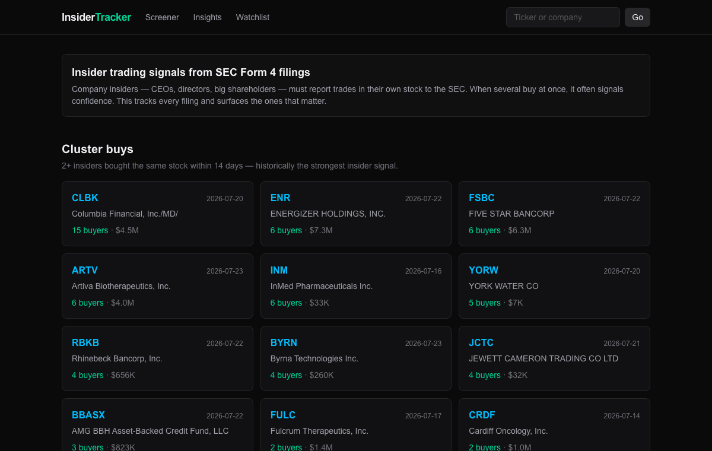
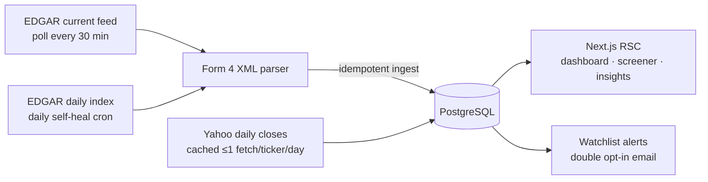

# Insider Tracker

[](https://github.com/alexislowys/insider-tracker/actions/workflows/ci.yml)
[](https://insider-tracker-three.vercel.app)


Track SEC Form 4 insider buys and sells: cluster-buy signals, per-company flow, and executive activity. Built with Next.js, PostgreSQL, and the SEC EDGAR API.

**Why:** insider buying is one of the most-cited "alternative data" signals in quant finance. I built this to test that claim on real filings end to end — ingest raw SEC data, clean it, and measure whether insider buys actually beat the market.

**▶ Live: [insider-tracker-three.vercel.app](https://insider-tracker-three.vercel.app)** · **📄 [Engineering case study](docs/CASE_STUDY.md)**



## Features

- **Cluster-buy detection** — flags companies where 2+ distinct insiders bought within 14 days, historically the strongest insider signal
- **Open-market trade feed** — latest buys (code P) and sells (code S), filtered from the noise of grants and option exercises
- **Company pages** — insider activity timeline plus a 90-day buy/sell dollar-flow chart
- **Insider pages** — full transaction history for any executive or director
- **Screener** — filter every trade by buy/sell, role (officer / director / 10% owner), minimum value, lookback window and ticker; sort by date, value or size. SQL built from a whitelist, user input only ever bound as parameters
- **Insights** — post-trade outcome stats: returns by insider role, excess return vs SPY, and a ranked "best insiders to follow" table (see *Signal evaluation* below)
- **Watchlist + email alerts** — star tickers (no account needed), then opt in to an email whenever a new Form 4 lands for one of them
- **Near-real-time ingestion** — polls EDGAR's current-filings feed every 30 minutes, plus a daily cron that re-ingests a 3-day window as a self-healing backstop; ingestion is idempotent so overlaps and reruns are free
- **Freshness monitoring** — a daily CI job hits `/api/health` and fails loudly if the newest filing is stale

## Signal evaluation

Track-record stats are designed to resist the obvious abuses:

- **Median return, not mean** — headline insider stats use the median; a single microcap moonshot shouldn't mint a "top insider." The mean is shown as labeled context.
- **Market-adjusted returns** — each buy is also scored against SPY over its exact holding period, so a rising tide isn't mistaken for skill. The dashboard reports the median excess return vs the S&P 500 and the share of buys that beat it.
- **Minimum 3 buys** before an insider gets a track record — no single-trade heroes.
- **10b5-1 planned trades flagged** — scheduled sales carry no information; they're marked so signal readers can exclude them.
- **Win rate** = share of buys positive at the measurement horizon, shown alongside return so a 90%-win/tiny-gain profile is distinguishable from lottery tickets.

Limitations, honestly: excess return is a raw difference vs SPY, not beta-adjusted (no CAPM alpha — a high-beta stock in a bull market still looks like skill), there's no survivorship handling for delistings, and the horizon is fixed. This is a screening tool, not a backtest.

## Architecture


```mermaid
flowchart LR
  A[EDGAR current feed<br/>poll every 30 min] --> C[Form 4 XML parser]
  B[EDGAR daily index<br/>daily self-heal cron] --> C
  C -->|idempotent ingest| D[(PostgreSQL)]
  Y[Yahoo daily closes<br/>cached ≤1 fetch/ticker/day] --> D
  D --> E[Next.js RSC<br/>dashboard · screener · insights]
  D --> F[Watchlist alerts<br/>double opt-in email]
```

EDGAR client is rate-limited to 8 req/s (under SEC's 10) with retry on 429/503.

- `src/lib/edgar/` — EDGAR HTTP client (throttled, SEC-compliant User-Agent), daily-index discovery, Form 4 XML parser
- `src/lib/db/` — schema + database adapter: any Postgres via `DATABASE_URL`, or zero-install [PGlite](https://pglite.dev/) for local dev
- `src/lib/ingest.ts` — idempotent filing ingestion (crash-safe, dedupes multi-filer index entries)
- `src/lib/queries.ts`, `screener.ts` — read queries for the UI
- `src/lib/track-record.ts`, `insights.ts`, `prices.ts` — return / excess-return stats and the price cache behind them
- `src/lib/alerts.ts` — watchlist email alerts (double opt-in, rate-limited)
- `src/app/` — dashboard, `/company/[ticker]`, `/insider/[cik]`, `/screener`, `/insights`, `/watchlist`, cron + health endpoints

### Form 4 edge cases handled

- Prices hidden in footnotes (stored as `NULL`, rendered as "footnote")
- Multi-owner filings and duplicate daily-index entries per filer
- Direct vs indirect ownership rows that otherwise look identical
- Missing/`NONE` tickers, weekend/holiday index files (EDGAR 403s), value-wrapped vs inline XML leaves

## Running locally

```bash
npm install
npx tsx scripts/ingest.ts --days 10   # backfill into local PGlite (no DB install needed)
npm run dev
```

Useful scripts:

```bash
npx tsx scripts/test-parser.ts        # parse 50 live filings, print results
npx tsx scripts/ingest.ts --days 5 --limit 100
npx tsx scripts/stats.ts              # row counts + sanity checks
```

## Deploying

1. Create a Postgres database (e.g. [Neon](https://neon.tech)) and set `DATABASE_URL`
2. Set `CRON_SECRET` to protect the ingestion endpoint
   (also add it as a GitHub Actions secret — the 30-minute poller uses it)
   Optional: `RESEND_API_KEY` + `ALERT_FROM` for watchlist emails (without them, sends are logged and skipped)
3. Deploy to Vercel — `vercel.json` schedules `/api/cron/ingest` weekdays at 22:30 UTC
4. Backfill once from your machine: `DATABASE_URL=... npx tsx scripts/ingest.ts --days 30`

## Security

- **Untrusted input** (SEC XML, EDGAR feeds) is parsed with a patched `fast-xml-parser`; all SQL is parameterized; EDGAR-sourced names are HTML-escaped before going into alert emails.
- **Cron routes** require a bearer secret, compared timing-safe and failing closed — an unset `CRON_SECRET` locks the endpoints rather than opening them.
- **Email alerts** use double opt-in with single-use, high-entropy tokens, a per-subscription resend cooldown, and a per-address hourly send cap so the subscribe endpoint can't be used to spam a victim address.
- **Headers**: HSTS, `X-Frame-Options: DENY`, `nosniff`, and a restrictive `Referrer-Policy`/`Permissions-Policy` are set globally.
- **Dependencies**: Dependabot security updates enabled; production dependency audit checked on upgrades.

## Data notes

Source: SEC EDGAR Form 4 filings. The client stays under the SEC's 10 req/s limit and identifies itself per SEC policy. Not investment advice.
